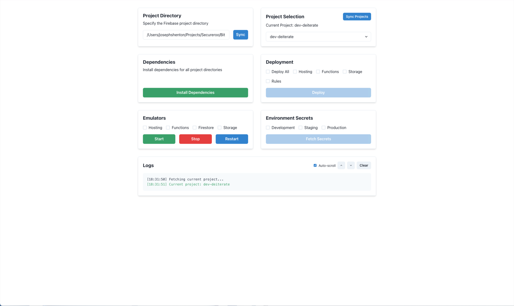

# React + TypeScript + Vite

This template provides a minimal setup to get React working in Vite with HMR and some ESLint rules.

Currently, two official plugins are available:

- [@vitejs/plugin-react](https://github.com/vitejs/vite-plugin-react/blob/main/packages/plugin-react/README.md) uses [Babel](https://babeljs.io/) for Fast Refresh
- [@vitejs/plugin-react-swc](https://github.com/vitejs/vite-plugin-react-swc) uses [SWC](https://swc.rs/) for Fast Refresh

## Expanding the ESLint configuration

If you are developing a production application, we recommend updating the configuration to enable type aware lint rules:

- Configure the top-level `parserOptions` property like this:

```js
export default tseslint.config({
  languageOptions: {
    // other options...
    parserOptions: {
      project: ['./tsconfig.node.json', './tsconfig.app.json'],
      tsconfigRootDir: import.meta.dirname,
    },
  },
})
```

- Replace `tseslint.configs.recommended` to `tseslint.configs.recommendedTypeChecked` or `tseslint.configs.strictTypeChecked`
- Optionally add `...tseslint.configs.stylisticTypeChecked`
- Install [eslint-plugin-react](https://github.com/jsx-eslint/eslint-plugin-react) and update the config:

```js
// eslint.config.js
import react from 'eslint-plugin-react'

export default tseslint.config({
  // Set the react version
  settings: { react: { version: '18.3' } },
  plugins: {
    // Add the react plugin
    react,
  },
  rules: {
    // other rules...
    // Enable its recommended rules
    ...react.configs.recommended.rules,
    ...react.configs['jsx-runtime'].rules,
  },
})
```
# Firebase Manager

A desktop application built with React and Electron for managing Firebase projects, deployments, emulators, and secrets. This tool provides a user-friendly interface for common Firebase development tasks.



## Features

- 📁 Project Directory Management
- 🔄 Firebase Project Switching
- 📦 Dependency Installation
- 🚀 Deployment Management
- 🛠 Emulator Controls
- 🔑 Environment Secrets Management
- 📝 Real-time Logging

## Prerequisites

- Node.js 16.x or higher
- npm or yarn
- Firebase CLI installed globally (`npm install -g firebase-tools`)
- Firebase project already initialized
- Google Cloud credentials configured

## Installation

1. Clone the repository:
   ```bash
   git clone https://github.com/yourusername/firebase-manager.git
   cd firebase-manager
   ```

2. Install dependencies:
   ```bash
   npm install
   ```

3. Start the development server:
   ```bash
   npm run dev
   ```

## Usage

### Project Directory Selection
1. Enter your Firebase project directory path in the "Project Directory" section
2. Click "Sync" to load the project configuration

### Project Selection
- View current Firebase project
- Switch between different Firebase projects
- Sync project list with Firebase

### Dependencies
- Install dependencies across all project directories with one click
- Real-time installation progress monitoring

### Deployment
- Select specific components to deploy:
  - Hosting
  - Storage
  - Functions
  - Rules
- Deploy all components at once
- Monitor deployment progress in real-time
- Cancel ongoing deployments

### Emulators
- Start/Stop/Restart Firebase emulators
- Select specific emulators to run:
  - Hosting
  - Functions
  - Firestore
  - Storage
- Real-time emulator status monitoring

### Secrets Management
- Fetch environment secrets for:
  - Development
  - Staging
  - Production
- Automatic .env file creation

## Architecture

### Components
- `App.tsx`: Main application layout
- `DirectorySelector.tsx`: Project directory management
- `ProjectSelector.tsx`: Firebase project selection
- `DeploymentPanel.tsx`: Deployment controls
- `EmulatorPanel.tsx`: Emulator management
- `SecretsPanel.tsx`: Environment secrets handling
- `DependencyInstaller.tsx`: Dependency management
- `LogsPanel.tsx`: Real-time logging display

### Context Providers
- `ProjectContext.tsx`: Project directory state management
- `LogsContext.tsx`: Logging system state management

### Core Services
- `FirebaseManager.ts`: Core Firebase operations handler
- `server.ts`: Backend server for Firebase CLI operations

## API Endpoints

The application runs a local server on port 3001 with the following endpoints:

- `POST /api/firebase/deploy`: Handle deployments
- `POST /api/firebase/emulators`: Manage emulators
- `GET /api/firebase/projects`: List Firebase projects
- `POST /api/secrets/fetch`: Fetch environment secrets
- `POST /api/firebase/install-dependencies`: Install project dependencies

## WebSocket Communication

Real-time updates are handled through WebSocket connections:
- Endpoint: `ws://localhost:3001/api/firebase/deploy-logs`
- Provides real-time feedback for:
  - Deployments
  - Emulator status
  - Dependency installation
  - Error messages

## Contributing

1. Fork the repository
2. Create your feature branch (`git checkout -b feature/amazing-feature`)
3. Commit your changes (`git commit -m 'Add amazing feature'`)
4. Push to the branch (`git push origin feature/amazing-feature`)
5. Open a Pull Request

## License

This project is licensed under the MIT License - see the [LICENSE](LICENSE) file for details.

## Support

For support, please open an issue in the GitHub repository or contact the maintainers.
