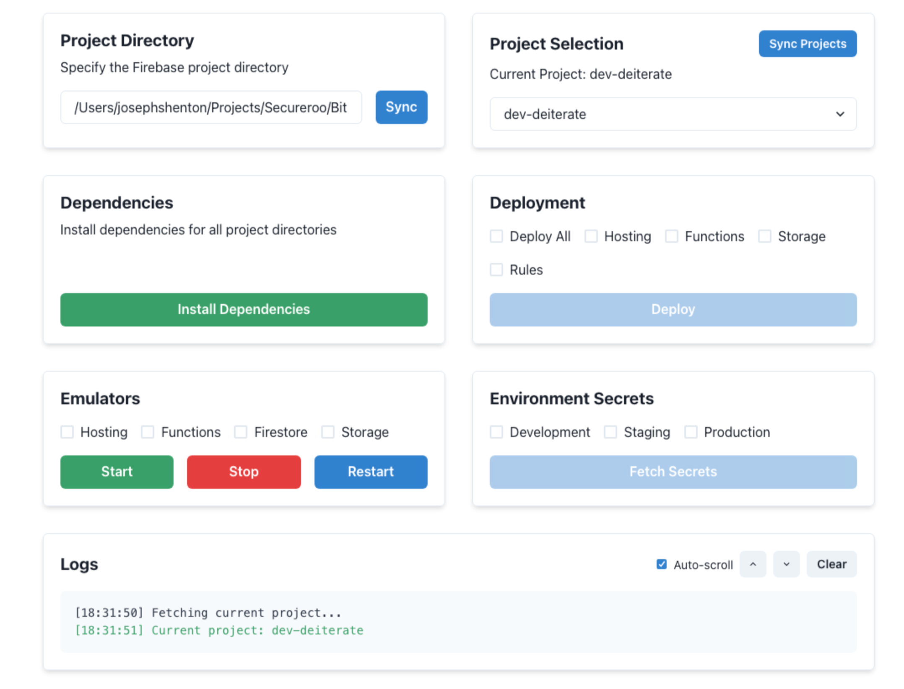

# GFM - Golden Firebase Manager

A desktop application built with React and Electron for managing Firebase projects, deployments, emulators, and secrets. This tool provides a user-friendly interface for common Firebase development tasks.



## Features

- 📁 Project Directory Management
- 🔄 Firebase Project Switching
- 📦 Dependency Installation
- 🚀 Deployment Management
- 🛠 Emulator Controls
- 🔑 Environment Secrets Management
- 📝 Real-time Logging
- 📄 Rules Panel
  - Edit and deploy Firestore and Storage security rules
  - Syntax highlighting with multiple theme options
  - Real-time validation and error checking
  - Auto-completion and bracket matching
  - Dark/Light theme support
  - Support for multiple rule types:
    - Firestore Rules
    - Storage Rules
- 🔧 Settings Panel
  - **Service Account Management**
    - Upload multiple service account keys
    - Set active service account
    - Delete service accounts
    - View service account details and status
  - **Google Analytics Configuration**
    - Configure GA4 Measurement ID
    - Manage analytics settings
    - Enable/disable analytics features
- 📊 Analytics Panel
  - View real-time analytics data
  - Customizable time ranges
  - User engagement metrics
  - Error handling for:
    - API permissions
    - Configuration issues
    - Service account setup
  - Direct links to enable required APIs
- 📂 Storage Panel
  - Browse and manage Firebase Storage
  - Upload and download files
  - Create and manage folders
  - View and edit storage rules
  - Manage file permissions
- 🔐 Auth Panel
  - Manage Firebase Authentication
  - View and manage users
  - Configure auth providers
  - Monitor authentication status
  - User role management
- 📊 Firestore Panel
  - Browse and manage Firestore database
  - Create and edit documents
  - Run queries
  - Manage collections
  - Import/Export data

## Coming Soon

- 📦 Hosting Panel

  - Deploy and manage web applications

- 🔄 Remote Config Panel

  - Manage feature flags and app configurations

- 🔧 Extensions Panel

  - Browse and manage Firebase Extensions

- 🤖 ML Panel

  - Train and deploy machine learning models

- 🔐 App Check Panel

  - Manage app security and verification

- 📈 Performance Panel

  - Monitor app performance metrics

- 🎲 A/B Testing Panel

  - Create and manage experiments

- 💥 Crashlytics Panel

  - Track and analyze app crashes

- 🧪 Test Panel

  - Real-time Playwright test execution and monitoring
  - Detailed test results with error reporting
  - Visual test status indicators
  - Automatic test discovery and organization
  - Quick navigation to failed tests

- 📊 Usage Analytics

  - Daily Firebase service consumption metrics
  - Resource usage tracking and alerts
  - Cost estimation and budget monitoring
  - Usage trend analysis and reporting

- 📁 File Management

  - Intelligent file versioning system
  - Automatic backup of moved files
  - Version history with .revision naming
  - Easy rollback capabilities

- 💻 Cloud Functions Panel

  - Real-time function logs and monitoring
  - Function deployment status
  - Error tracking and debugging
  - Performance metrics and insights
  - Cold start analysis

## Prerequisites

- Bun by oven.sh - [Link](https://bun.sh/)
- Firebase CLI installed globally (`npm install -g firebase-tools`)
- Firebase project already initialized
- Google Cloud credentials configured

1. Clone the repository:

```bash
git clone https://github.com/moderniselife/GFM.git
cd GFM
```

2. Install dependencies:

```bash
bun install
```

3. Start the development server:

```bash
bun run start
```

## Development

```bash
bun dev
```

## Building

```bash
bun run build
```

## Usage

### Project Directory Selection

1. Enter your Firebase project directory path in the "Project Directory" section
2. Click "Sync" to load the project configuration

### Project Selection

- View current Firebase project
- Switch between different Firebase projects
- Sync project list with Firebase

### Dependencies

- Install dependencies across all project directories with one click
- Real-time installation progress monitoring

### Deployment

- Select specific components to deploy:
  - Hosting
  - Storage
  - Functions
  - Rules
- Deploy all components at once
- Monitor deployment progress in real-time
- Cancel ongoing deployments

### Emulators

- Start/Stop/Restart Firebase emulators
- Select specific emulators to run:
  - Hosting
  - Functions
  - Firestore
  - Storage
- Real-time emulator status monitoring

### Secrets Management

- Fetch environment secrets for:
  - Development
  - Staging
  - Production
- Automatic .env file creation

## Architecture

### Components

- `App.tsx`: Main application layout
- `DirectorySelector.tsx`: Project directory management
- `ProjectSelector.tsx`: Firebase project selection
- `DeploymentPanel.tsx`: Deployment controls
- `EmulatorPanel.tsx`: Emulator management
- `SecretsPanel.tsx`: Environment secrets handling
- `DependencyInstaller.tsx`: Dependency management
- `LogsPanel.tsx`: Real-time logging display

### Context Providers

- `ProjectContext.tsx`: Project directory state management
- `LogsContext.tsx`: Logging system state management

### Core Services

- `FirebaseManager.ts`: Core Firebase operations handler
- `server.ts`: Backend server for Firebase CLI operations

## API Endpoints

The application runs a local server on port 3001 with the following endpoints:

- `POST /api/firebase/deploy`: Handle deployments
- `POST /api/firebase/emulators`: Manage emulators
- `GET /api/firebase/projects`: List Firebase projects
- `POST /api/secrets/fetch`: Fetch environment secrets
- `POST /api/firebase/install-dependencies`: Install project dependencies

## WebSocket Communication

Real-time updates are handled through WebSocket connections:

- Endpoint: `ws://localhost:3001/api/gfm/logs`
- Provides real-time feedback for:
  - Deployments
  - Emulator status
  - Dependency installation
  - Error messages

## Contributing

1. Fork the repository
2. Create your feature branch (`git checkout -b feature/amazing-feature`)
3. Commit your changes (`git commit -m 'Add amazing feature'`)
4. Push to the branch (`git push origin feature/amazing-feature`)
5. Open a Pull Request

## License

This project is licensed under the MIT License - see the [LICENSE](LICENSE) file for details.

## Support

For support, please open an issue in the GitHub repository or contact the maintainers.
